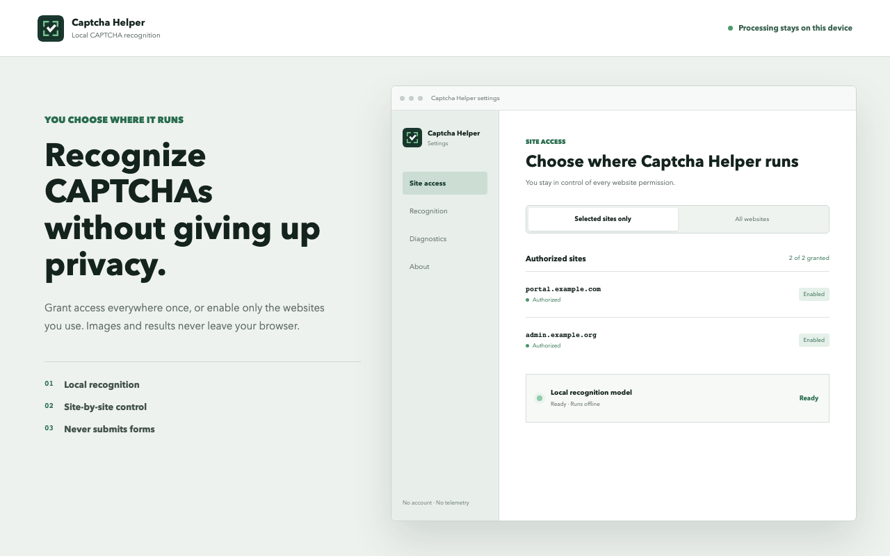

<div align="center">
  
  <h1>Captcha Helper</h1>
  <p>Local, privacy-first recognition for common static CAPTCHAs.</p>
  <p>
    <a href="README.zh-CN.md">简体中文</a>
    ·
    <a href="https://linux.do">linux.do</a>
  </p>
  <p>
    <a href="https://github.com/hongshuo-wang/local-captcha-solver/actions/workflows/ci.yml"></a>
    <a href="https://github.com/hongshuo-wang/local-captcha-solver/releases"></a>
    <a href="LICENSE"></a>
    <a href="https://developer.chrome.com/docs/extensions/develop/migrate/what-is-mv3"></a>
    <a href="https://linux.do"></a>
  </p>
</div>



Captcha Helper is a Chromium extension for people who repeatedly encounter static text CAPTCHAs in administration panels, internal tools, and information systems. It recognizes supported images on the user's device and can fill a matching input field without clicking or submitting the form.

The extension has no account system, advertising, telemetry, or remote OCR service. Users can grant access to every HTTP/HTTPS site once or authorize only the sites they regularly use.

## Why install it?

- Reduce repeated visual inspection and typing on supported CAPTCHA styles.
- Keep CAPTCHA images and recognition results inside the browser.
- Choose between global access and an exact list of authorized sites.
- Review authorized, disabled, and browser-revoked permissions from one settings page.
- Avoid accidental submission: Captcha Helper never clicks a submit button or submits a form.
- Abstain on uncertain arithmetic or low-confidence recognition instead of guessing.

## Supported scope

Captcha Helper is intentionally limited to static, single-image CAPTCHAs containing:

- digits;
- English letters;
- alphanumeric strings; or
- one-step integer arithmetic using `+`, `-`, `*`, `/`, `x`, `X`, `×`, or `÷`.

It does not support image-selection challenges, sliders, puzzles, animation, multi-step mathematics, behavioral verification, or other interactive CAPTCHA systems. Different websites use different image and CORS policies, so no extension can guarantee recognition of every image.

## Installation

### Chrome Web Store

The first Chrome Web Store release is currently under review. Its link will be added here after approval.

### GitHub release

After the first public release, download the Chrome or Edge ZIP from [GitHub Releases](https://github.com/hongshuo-wang/local-captcha-solver/releases), extract it, enable developer mode on the browser's extensions page, and load the extracted directory as an unpacked extension.

### Build from source

Requirements: Node.js 22 or later and npm.

```sh
git clone https://github.com/hongshuo-wang/local-captcha-solver.git
cd local-captcha-solver
npm ci
npm run build
```

Open `chrome://extensions`, enable **Developer mode**, choose **Load unpacked**, and select `.output/chrome-mv3`. For Edge, run `npm run build:edge` and load `.output/edge-mv3` from `edge://extensions`.

## Usage

1. Complete the standalone onboarding page opened after installation.
2. Choose all-site access or selected-site access.
3. Open a supported page and initiate recognition from the popup, the image context menu, or the configured mouse shortcut.
4. Review the result when the extension cannot identify one safe, empty input field.

Recognition and automatic filling are separate decisions. A valid result is filled only into a unique eligible field at the configured confidence threshold. Existing user input is never replaced without confirmation.

## Permissions

| Permission | Why it is needed |
| --- | --- |
| `activeTab` | Temporarily accesses the active page after an explicit user action. |
| `clipboardWrite` | Copies a result only through an explicit command or an enabled optional setting. The extension does not read the clipboard. |
| `contextMenus` | Adds the image command for user-initiated recognition. |
| `offscreen` | Runs the bundled ONNX/WebAssembly model in a Manifest V3 offscreen document. |
| `scripting` | Installs the page helper after the user grants access. |
| `storage` | Keeps settings, permission state, model state, and sanitized diagnostics locally. |
| Optional HTTP/HTTPS hosts | Lets the user choose global access or grant individual sites. |

See the full [Privacy Policy](PRIVACY.md). CAPTCHA images, recognition results, settings, and diagnostics are not sent to the developer or a third-party service.

## Diagnostics

The extension stores at most 20 sanitized diagnostic records locally. Records may contain OCR text, confidence, image dimensions, hostname, field-match outcome, and a bounded error message. They never contain image bytes, data URLs, full page URLs, query strings, passwords, or form submissions, and users can clear them at any time.

## Model quality

The bundled 2.24 MB CAPTCHA CTC model runs fully offline. On the isolated 10,000-image validation set, the configured automatic-fill policy reaches 99.587% precision at 82.38% coverage. The frozen 201-image benchmark reaches 98.01% whole-string/fill accuracy and 100% arithmetic-answer accuracy.

On the documented Apple M4 Pro reference machine, browser recognition measured 11.70 ms warm P95 in Chrome and 12.50 ms in Edge; Edge model warmup completed in 266 ms. These measurements describe the frozen corpus and reference environment, not every website.

The approved [model card](training/ppocrv6-captcha/model-cards/paddle-ctc-v4-decoupled-320k.md) records data provenance, group isolation, licenses, Paddle/ONNX parity, thresholds, and browser verification. See [model reproduction](docs/production-model-reproduction.md) for the reproducible workflow.

## Development

```sh
npm ci
npm run typecheck
npm test
npm run build
npm run build:edge
npm run test:e2e:extension
```

Store artwork is maintained as HTML/CSS and rendered with `npm run store:assets`.

Stable releases follow [Semantic Versioning](https://semver.org/). A `vMAJOR.MINOR.PATCH` tag must match `package.json` and have a corresponding [CHANGELOG](CHANGELOG.md) section. GitHub Actions then verifies the project, builds Chrome and Edge ZIPs, generates checksums, and creates the GitHub Release. Maintainer steps and store secret names are documented in [docs/releasing.md](docs/releasing.md).

## Contributing

Read [CONTRIBUTING.md](CONTRIBUTING.md) before opening a pull request. New CAPTCHA styles must be submitted as reproducible, authorized scenarios with exact labels, provenance, licenses, isolated groups, and a held-out failing benchmark. Do not add benchmark fixtures to training or validation data.

Security reports should follow [SECURITY.md](SECURITY.md). Community participation is governed by the [Code of Conduct](CODE_OF_CONDUCT.md).

## Community

Project discussions and broader developer conversations are also welcome on [linux.do](https://linux.do). Please keep bug reports and reproducible project issues in this repository so they remain searchable and actionable.

## License

Source code is available under the [MIT License](LICENSE). Bundled models, runtime components, datasets, fonts, and derived assets retain their respective notices and licenses; see [THIRD_PARTY_NOTICES.md](THIRD_PARTY_NOTICES.md) and `third_party/`.
