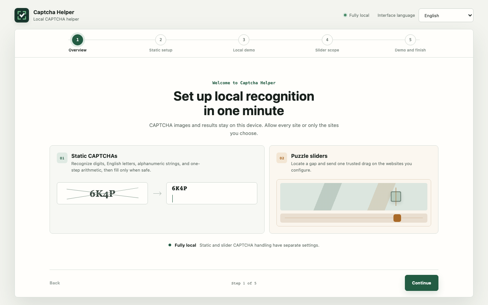

<div align="center">
  
  <h1>Captcha Helper</h1>
  <p>Local, privacy-first recognition for common CAPTCHAs, including a puzzle-slider beta.</p>
  <p><a href="README.zh-CN.md">简体中文</a></p>
  <p>
    <a href="https://github.com/hongshuo-wang/local-captcha-solver/actions/workflows/ci.yml"></a>
    <a href="https://github.com/hongshuo-wang/local-captcha-solver/releases"></a>
    <a href="LICENSE"></a>
    <a href="https://developer.chrome.com/docs/extensions/develop/migrate/what-is-mv3"></a>
    <a href="https://linux.do"></a>
  </p>
</div>



Captcha Helper is an open-source Chromium extension that recognizes common static text CAPTCHAs entirely on the user's device and can optionally handle single-gap puzzle sliders. It can fill a reliable text result into one matching empty field, but it never clicks a submit button or submits a form.

There is no account, advertising, telemetry, remote OCR service, or runtime model download. Users can authorize every HTTP/HTTPS site or maintain an exact list of allowed sites.

## Supported scope

The project intentionally supports one static image containing:

- digits;
- uppercase or lowercase English letters;
- alphanumeric strings; or
- one-step integer arithmetic using `+`, `-`, `*`, `/`, `x`, `X`, `×`, or `÷`.

Arithmetic images may end in `=?`, `=`, `?`, or no suffix. Subtraction produces nonnegative answers and division must be exact. Image selection, animation, behavioral challenges, non-Latin scripts, decimals, remainders, negative results, and multi-step mathematics are outside the static OCR scope.

The separate puzzle-slider Beta supports desktop Chrome/Edge single-gap horizontal challenges with stable visible image resources. It is provider-neutral and has been checked with the [GeeTest demo](https://2captcha.com/demo/geetest). In Settings, slider handling can be configured for all HTTP/HTTPS sites or for an exact list of sites. It uses the browser `debugger` permission to send trusted drag input, and the browser may show a confirmation prompt during installation or an upgrade. Ambiguous, changing, low-confidence, or rejected challenges are left for the user.

## Installation

### Browser stores

Install the extension directly from the official browser stores:

- [Microsoft Edge Add-ons](https://microsoftedge.microsoft.com/addons/detail/captcha-helper-%E6%9C%AC%E5%9C%B0%E9%AA%8C%E8%AF%81%E7%A0%81%E5%8A%A9%E6%89%8B/pibbaaacfjbfcoahjfhnbfdlefgjfbfd)
- [Chrome Web Store](https://chromewebstore.google.com/detail/captcha-helper-%E6%9C%AC%E5%9C%B0%E9%AA%8C%E8%AF%81%E7%A0%81%E5%8A%A9%E6%89%8B/jdpjgicecfidnfbpfdnihpjhpjcahada?hl=zh-CN&utm_source=ext_sidebar)

### GitHub Release

Download the Chrome or Edge ZIP and `SHA256SUMS.txt` from [GitHub Releases](https://github.com/hongshuo-wang/local-captcha-solver/releases). Verify the checksum, extract the ZIP, enable developer mode on the browser's extensions page, and load the extracted directory as an unpacked extension.

### Build from source

Requirements: Node.js 22 or later and npm.

```sh
git clone https://github.com/hongshuo-wang/local-captcha-solver.git
cd local-captcha-solver
npm ci
npm run build
```

Open `chrome://extensions`, enable **Developer mode**, choose **Load unpacked**, and select `.output/chrome-mv3`. For Edge, run `npm run build:edge` and load `.output/edge-mv3` from `edge://extensions`.

## Usage

1. Complete the onboarding page opened after installation.
2. Choose all-site access or selected-site access.
3. Start recognition from the popup, an image context menu, or the configured mouse shortcut.
4. Review the result when the extension cannot identify one safe, empty input field.

### Puzzle sliders

1. Open Settings -> Puzzle sliders.
2. Choose `All sites` or `Selected sites only`. The selected-site mode is the safer default and lets you add exact hostnames.
3. Confirm the browser `debugger` permission if the browser requests it. It is used only during a manual run or an automatic run on an enabled site, then detached.
4. Test with the [GeeTest demo](https://2captcha.com/demo/geetest).

The extension monitors enabled sites for a unique visible slider, waits for the page and user input to settle, verifies the challenge again before dragging, and stops instead of guessing when the geometry or result is uncertain. Manual handling from the popup is available even when automatic slider handling is off, subject to site access and debugger permission.

### Upgrading to 1.2.0

Users upgrading from an earlier version see one standalone upgrade tab for the new slider feature. Configure the slider site scope, review the permission summary, and open the GeeTest demo in a separate tab. Existing static OCR settings continue unchanged.

Recognition and automatic filling are separate decisions. Automatic filling requires a result above the category-specific confidence threshold and one unique eligible empty field. Existing input is never replaced without confirmation. Structurally ambiguous arithmetic and low-confidence results are rejected instead of guessed.

For sites with a known CAPTCHA alphabet, the popup can store an exact-host override for digits, English letters, alphanumeric text, or arithmetic. The selected alphabet constrains CTC decoding directly; it does not rewrite characters after recognition. Overrides apply to automatic, popup, shortcut, and context-menu recognition and can be restored to automatic detection from Settings.

## Privacy and permissions

CAPTCHA images, recognition results, settings, and sanitized diagnostics remain in the browser. See the [Privacy Policy](PRIVACY.md) for the complete data-handling description.

| Permission | Purpose |
| --- | --- |
| `activeTab` | Temporarily access the active page after an explicit user action. |
| `clipboardWrite` | Copy a result through an explicit command or optional setting; the extension cannot read the clipboard. |
| `contextMenus` | Add user-initiated recognition for page images. |
| `debugger` | Send trusted mouse input only for a manually requested slider run or a slider site explicitly enabled by the user; the connection is detached after every attempt. |
| `offscreen` | Run the bundled ONNX/WebAssembly model in a Manifest V3 offscreen document. |
| `scripting` | Install the page helper after the user grants access. |
| `storage` | Store settings, permission state, model state, and up to 20 sanitized diagnostic records locally. |
| Optional HTTP/HTTPS hosts | Let the user grant all-site or exact-site access independently for OCR and puzzle-slider monitoring. |

## Model

The production model is `paddle-ctc-v4-decoupled-320k`, a 2.24 MB recognition model derived from the PP-OCRv6 tiny recognition network. It uses a PPLCNetV4 tiny backbone and the CTC branch of PaddleOCR's recognition head:

```text
image -> BGR resize/pad to [3, 48, 320] -> PPLCNetV4 tiny -> CTC head
      -> 71-class probabilities -> CTC decode -> text or arithmetic answer
```

The fixed alphabet contains 70 visible characters; class 0 is the CTC blank. The exported ONNX model runs through ONNX Runtime Web using bundled WASM assets. The same model handles digits, letters, alphanumeric strings, and arithmetic; category-specific decoding and confidence thresholds determine whether to return or automatically fill a result.

### Training data

The approved model manifest contains 255,183 unique images:

| Split | Source | Images | Use |
| --- | --- | ---: | --- |
| train | four licensed public datasets | 145,183 | Real generator distributions |
| train | deterministic synthetic groups | 100,000 | Balanced content and visual augmentation |
| validation | isolated synthetic groups | 10,000 | Model selection and threshold calibration |

Training uses a deterministic 320,000-row balanced label list: 80,000 rows each for digits, letters, alphanumeric strings, and arithmetic. Public sources are recorded as CC-BY-4.0, CC0-1.0, or Apache-2.0 in the dataset catalog. Every sample has an exact label, SHA-256, source, license id, scenario group, and split in `training/ppocrv6-captcha/data/manifest.json`.

Groups never cross splits, and frozen benchmark hashes are rejected from training and validation. The synthetic generator covers font variation, color and contrast, rotation, shear, spacing, waves, outlines, shadows, noise, interference lines, blur, resampling, and compression artifacts.

### Quality

| Evaluation | Result |
| --- | ---: |
| Automatic-fill precision on 10,000 isolated validation images | 99.587% |
| Automatic-fill coverage on the same validation set | 82.38% |
| Frozen 201-image whole-string/fill accuracy | 98.01% |
| Frozen arithmetic-answer accuracy | 100% |
| Chrome warm P95 on Apple M4 Pro | 11.70 ms |
| Edge warm P95 on Apple M4 Pro | 12.50 ms |

These figures describe the frozen corpus and documented reference environment, not every website. Full provenance, per-category/operator results, model hashes, Paddle-to-ONNX parity, and browser checks are recorded in the [model card](training/ppocrv6-captcha/model-cards/paddle-ctc-v4-decoupled-320k.md).

## Retraining the model

The pinned reference environment uses PaddleOCR `v3.7.0` at commit `b03f46425e8ff4442b268ce449e3eef758146cd4`, PaddlePaddle `3.2.0`, Python `3.12.11`, Node.js 22, and seed `20260728`. A GPU environment must use the matching PaddlePaddle build and record CUDA, cuDNN, driver, and package versions in a new model card.

### Prepare data

```sh
npm ci
npm run training:ppocrv6:fetch

npm run training:public:fetch -- mathcaptcha10k-v6
npm run training:public:fetch -- parsasam-captcha-v1
npm run training:public:fetch -- huthayfahodeb-captcha-v2
npm run training:public:fetch -- daniilnxy-math-problem-captcha-v1

npm run training:public:import -- mathcaptcha10k-v6
npm run training:public:import -- parsasam-captcha-v1
npm run training:public:import -- huthayfahodeb-captcha-v2
npm run training:public:import -- daniilnxy-math-problem-captcha-v1

npm run training:synthetic:generate
npm run training:labels:balance -- 80000
npm test -- tests/training
```

Downloads, extracted datasets, generated images, checkpoints, and training output are ignored by Git. Dataset licenses and archive hashes must be reviewed before any new public source is enabled.

### Train from a clean environment

Clone the pinned PaddleOCR revision and install `training/ppocrv6-captcha/python-environment.txt`. Because the official model uses a different alphabet, first freeze the backbone and warm up the new head for three epochs, then fine-tune the full model for 60 epochs:

```sh
PADDLEOCR_ROOT=/absolute/path/to/PaddleOCR-v3.7.0 \
  training/ppocrv6-captcha/.venv/bin/python \
  training/ppocrv6-captcha/train_head_warmup.py \
  -c training/ppocrv6-captcha/config.yml -o \
  Global.epoch_num=3 \
  Global.save_model_dir=./training/ppocrv6-captcha/output/clean-warmup

PADDLEOCR_ROOT=/absolute/path/to/PaddleOCR-v3.7.0 \
  training/ppocrv6-captcha/.venv/bin/python \
  /absolute/path/to/PaddleOCR-v3.7.0/tools/train.py \
  -c training/ppocrv6-captcha/config.yml -o \
  Global.epoch_num=60 \
  Global.pretrained_model=./training/ppocrv6-captcha/output/clean-warmup/latest.pdparams \
  Global.save_model_dir=./training/ppocrv6-captcha/output/clean-full
```

To continue from the production checkpoint for a new authorized scenario, create a new candidate id, use a low learning-rate experiment, and retain the production model as the baseline. Add held-out failures before tuning; do not train on issue screenshots or benchmark fixtures.

The complete commands for environment setup, continuation training, Paddle export, ONNX conversion, parity checks, threshold calibration, frozen benchmarks, and offline Chrome/Edge verification are in [Production model reproduction](docs/production-model-reproduction.md). Scenario contribution and data-isolation rules are in [Model training and scenario contributions](docs/model-training.md).

A production replacement must still achieve at least 99.5% automatic-fill precision, 80% coverage, a 3-second cold start, and a 500 ms warm P95. Results must be reported by category, source, scenario group, and arithmetic symbol. A weak or missing arithmetic operator must cause abstention, never a digits fallback.

## Development

```sh
npm ci
npm run typecheck
npm test
npm run build
npm run build:edge
npm run test:e2e:extension
```

## Contributing

Read [CONTRIBUTING.md](CONTRIBUTING.md) before opening a pull request. New CAPTCHA styles require authorized samples, exact labels, provenance and licenses, an isolated group, a held-out failing benchmark, and a description of the missing visual mechanism. Security reports should follow [SECURITY.md](SECURITY.md).

Project discussions and broader developer conversations are welcome on [linux.do](https://linux.do). Keep reproducible bugs and scenario contributions in this repository so they remain searchable and testable.

## License

Source code is available under the [MIT License](LICENSE). Bundled models, runtime components, datasets, fonts, and derived assets retain their respective notices and licenses; see [THIRD_PARTY_NOTICES.md](THIRD_PARTY_NOTICES.md) and `third_party/`.
