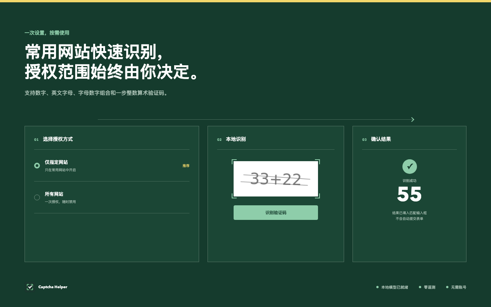

<div align="center">
  
  <h1>Captcha Helper · 本地验证码助手</h1>
  <p>在浏览器本地识别常见静态验证码，授权范围始终由用户决定。</p>
  <p>
    <a href="README.md">English</a>
    ·
    <a href="https://linux.do">linux.do</a>
  </p>
  <p>
    <a href="https://github.com/hongshuo-wang/local-captcha-solver/actions/workflows/ci.yml"></a>
    <a href="https://github.com/hongshuo-wang/local-captcha-solver/releases"></a>
    <a href="LICENSE"></a>
    <a href="https://developer.chrome.com/docs/extensions/develop/migrate/what-is-mv3"></a>
    <a href="https://linux.do"></a>
  </p>
</div>



Captcha Helper 是一款面向 Chromium 浏览器的本地验证码识别扩展，适合经常使用管理后台、内部工具、查询平台以及其他需要反复输入静态验证码的用户。扩展在用户设备上完成识别，可以将可靠结果填入匹配的输入框，但不会点击按钮或提交表单。

扩展不需要账号，不包含广告，不使用遥测，也不依赖远程 OCR 服务。用户既可以一次授权所有 HTTP/HTTPS 网站，也可以只允许自己常用的几个网站运行。

## 为什么安装它？

- 减少对支持类型验证码的重复辨认和手动输入。
- 验证码图片和识别结果始终留在浏览器本地。
- 可以在全局授权和指定网站授权之间自由选择。
- 在同一个设置页面查看已授权、已禁用和被浏览器移除权限的网站。
- 不会误提交：扩展从不点击提交按钮，也不会自动提交表单。
- 算式结构不明确或识别置信度不足时主动停止，不用猜测结果。

## 支持范围

Captcha Helper 有意将核心范围限制在以下静态单图片验证码：

- 纯数字；
- 英文字母；
- 字母数字组合；
- 使用 `+`、`-`、`*`、`/`、`x`、`X`、`×` 或 `÷` 的一步整数算术。

扩展不支持图片选择、滑块、拼图、动画、多步数学、行为验证或其他交互式验证码。不同网站的图片来源和 CORS 策略存在差异，因此无法保证识别每一种图片。

## 安装

### Chrome 应用商店

首个 Chrome 应用商店版本正在审核，审核通过后会在这里补充正式地址。

### GitHub Release

首次公开发布后，可以从 [GitHub Releases](https://github.com/hongshuo-wang/local-captcha-solver/releases) 下载 Chrome 或 Edge ZIP。解压后打开浏览器扩展管理页、启用开发者模式，并选择解压后的目录进行加载。

### 从源码构建

需要 Node.js 22 或更高版本以及 npm。

```sh
git clone https://github.com/hongshuo-wang/local-captcha-solver.git
cd local-captcha-solver
npm ci
npm run build
```

打开 `chrome://extensions`，启用“开发者模式”，点击“加载已解压的扩展程序”，选择 `.output/chrome-mv3`。Edge 用户运行 `npm run build:edge` 后，在 `edge://extensions` 中加载 `.output/edge-mv3`。

## 使用方法

1. 安装后完成自动打开的独立引导页面。
2. 选择全局授权或指定网站授权。
3. 在支持的网站中，通过扩展面板、图片右键菜单或设置的鼠标快捷操作发起识别。
4. 当扩展无法确定唯一且安全的输入框时，由用户确认结果和目标输入框。

“识别成功”和“允许自动填入”是两个独立判断。只有结果达到对应类型的置信度阈值，并且页面上存在唯一、为空且符合条件的输入框时，扩展才会自动填入。已有用户输入不会在未经确认时被替换。

## 权限说明

| 权限 | 使用原因 |
| --- | --- |
| `activeTab` | 用户主动操作后临时访问当前页面。 |
| `clipboardWrite` | 用户明确复制结果或启用可选复制设置时写入剪贴板；扩展不会读取剪贴板。 |
| `contextMenus` | 为网页图片添加用户主动触发的识别命令。 |
| `offscreen` | 在 Manifest V3 离屏文档中运行扩展自带的 ONNX/WebAssembly 模型。 |
| `scripting` | 用户授权后安装网页识别辅助脚本。 |
| `storage` | 在本地保存设置、权限状态、模型状态和经过清理的诊断记录。 |
| 可选 HTTP/HTTPS 网站权限 | 允许用户选择全局授权或逐个网站授权。 |

完整说明见[隐私政策](PRIVACY.md)。验证码图片、识别结果、设置和诊断记录都不会发送给开发者或第三方服务。

## 诊断记录

扩展最多在本地保存 20 条经过清理的诊断记录。记录可能包含 OCR 文本、置信度、图片尺寸、网站主机名、输入框匹配结果和长度受限的错误信息，但不会包含图片字节、Data URL、完整网页地址、查询参数、密码或表单提交内容。用户可以随时清除这些记录。

## 模型质量

扩展内置的 CAPTCHA CTC 模型大小为 2.24 MB，全程离线运行。在隔离的 10,000 张验证集中，当前自动填入策略达到 99.587% 精确率和 82.38% 覆盖率；冻结的 201 张基准集达到 98.01% 整串/填入准确率和 100% 算术答案准确率。

在文档记录的 Apple M4 Pro 参考环境中，Chrome 热启动 P95 识别耗时为 11.70 ms，Edge 为 12.50 ms，Edge 模型预热为 266 ms。这些结果仅代表冻结基准和参考环境，不代表所有网站样式。

已批准的[模型卡](training/ppocrv6-captcha/model-cards/paddle-ctc-v4-decoupled-320k.md)记录了数据来源、分组隔离、许可证、Paddle/ONNX 一致性、阈值和浏览器验证。复现流程见[生产模型复现文档](docs/production-model-reproduction.md)。

## 开发

```sh
npm ci
npm run typecheck
npm test
npm run build
npm run build:edge
npm run test:e2e:extension
```

商店宣传图使用 HTML/CSS 维护，可以通过 `npm run store:assets` 重新导出。

稳定版本遵循[语义化版本](https://semver.org/lang/zh-CN/)。`v主版本.次版本.修订号` 标签必须与 `package.json` 一致，并在 [CHANGELOG](CHANGELOG.md) 中存在对应章节。GitHub Actions 随后会验证项目、构建 Chrome/Edge ZIP、生成校验和并创建 GitHub Release。维护者操作步骤和商店密钥名称见[发布指南](docs/releasing.md)。

## 参与贡献

提交 Pull Request 前请阅读 [CONTRIBUTING.md](CONTRIBUTING.md)。新的验证码样式必须作为可复现且得到授权的场景提交，并提供精确标签、来源、许可证、隔离分组和失败的留出基准。禁止将基准样本加入训练集或验证集。

安全问题请按照 [SECURITY.md](SECURITY.md) 私下报告。社区参与遵循[行为准则](CODE_OF_CONDUCT.md)。

## 社区

也欢迎在 [linux.do](https://linux.do) 参与项目和开发相关交流。为了让问题可以被检索、复现和跟踪，请仍然将 Bug 与可复现场景提交到本仓库。

## 许可证

源代码使用 [MIT License](LICENSE)。内置模型、运行时组件、数据集、字体和派生资源保留各自的声明与许可证，详见 [THIRD_PARTY_NOTICES.md](THIRD_PARTY_NOTICES.md) 和 `third_party/`。
