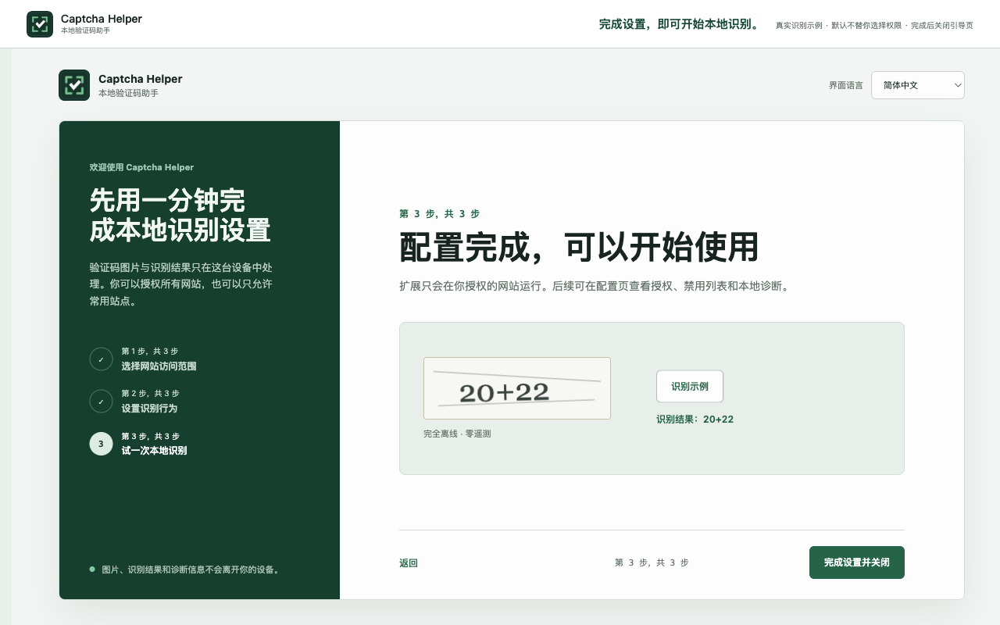

<div align="center">
  
  <h1>Captcha Helper · 本地验证码助手</h1>
  <p>在浏览器本地识别常见静态验证码，并实验性处理逐站授权的拼图滑块，授权范围始终由用户决定。</p>
  <p><a href="README.md">English</a></p>
  <p>
    <a href="https://github.com/hongshuo-wang/local-captcha-solver/actions/workflows/ci.yml"></a>
    <a href="https://github.com/hongshuo-wang/local-captcha-solver/releases"></a>
    <a href="LICENSE"></a>
    <a href="https://developer.chrome.com/docs/extensions/develop/migrate/what-is-mv3"></a>
    <a href="https://linux.do"></a>
  </p>
</div>



Captcha Helper 是一款开源 Chromium 浏览器扩展，完全在用户设备上识别常见静态文字验证码。它可以把可靠结果填入唯一匹配的空输入框，但不会点击提交按钮，也不会提交表单。

项目不需要账号，不包含广告和遥测，不依赖远程 OCR 服务，也不会在运行时下载模型。用户可以授权所有 HTTP/HTTPS 网站，也可以只维护一个精确的网站允许列表。

## 支持范围

项目有意只支持包含以下内容的静态单图片验证码：

- 纯数字；
- 大写或小写英文字母；
- 英文字母与数字组合；
- 使用 `+`、`-`、`*`、`/`、`x`、`X`、`×` 或 `÷` 的一步整数算术。

算式可以使用 `=?`、`=`、`?` 或无后缀形式。减法结果必须非负，除法必须整除。图片选择、动画、行为验证、非拉丁文字、小数、余数、负数结果和多步数学不在静态 OCR 范围内。动态滑块目前处于 Beta：仅支持桌面 Chrome/Edge、单个缺口、水平轨道和可稳定读取视觉资源的拼图挑战；必须为每个精确主机名单独开启，不能全局自动开启。滑块会发送浏览器级拖动，因此误判可能操作页面控件；遇到多个挑战、结构变化、低置信度或服务端拒绝时会停止并交还用户。

GeeTest V4 是自适应行为验证产品，插件只支持其中可识别的拼图滑块挑战，不代表支持整个 GeeTest V4。

## 安装

### 浏览器应用商店

也可以从官方浏览器应用商店直接安装：

- [Microsoft Edge 加载项](https://microsoftedge.microsoft.com/addons/detail/captcha-helper-%E6%9C%AC%E5%9C%B0%E9%AA%8C%E8%AF%81%E7%A0%81%E5%8A%A9%E6%89%8B/pibbaaacfjbfcoahjfhnbfdlefgjfbfd)
- [Chrome 应用商店](https://chromewebstore.google.com/detail/captcha-helper-%E6%9C%AC%E5%9C%B0%E9%AA%8C%E8%AF%81%E7%A0%81%E5%8A%A9%E6%89%8B/jdpjgicecfidnfbpfdnihpjhpjcahada?hl=zh-CN&utm_source=ext_sidebar)

### GitHub Release

从 [GitHub Releases](https://github.com/hongshuo-wang/local-captcha-solver/releases) 下载 Chrome 或 Edge ZIP 以及 `SHA256SUMS.txt`。校验文件后解压 ZIP，打开浏览器扩展管理页、启用开发者模式，并加载解压后的目录。

### 从源码构建

需要 Node.js 22 或更高版本以及 npm。

```sh
git clone https://github.com/hongshuo-wang/local-captcha-solver.git
cd local-captcha-solver
npm ci
npm run build
```

打开 `chrome://extensions`，启用“开发者模式”，点击“加载已解压的扩展程序”，选择 `.output/chrome-mv3`。Edge 用户运行 `npm run build:edge` 后，在 `edge://extensions` 中加载 `.output/edge-mv3`。

## 使用方法

1. 完成安装后自动打开的引导页面。
2. 选择所有网站授权或指定网站授权。
3. 通过扩展面板、图片右键菜单或配置的鼠标快捷操作发起识别。
4. 当扩展无法确定唯一且安全的空输入框时，由用户检查识别结果和目标输入框。

“识别成功”和“允许自动填入”是两个独立判断。自动填入要求结果达到对应类别的置信度阈值，并且页面中只有一个符合条件的空输入框。已有输入不会在未经确认时被替换。算式结构不明确或识别置信度不足时，扩展会拒绝填写而不是猜测。

如果已知某个网站的验证码字符范围，可以在弹窗中按精确主机名设置纯数字、纯英文、英数混合或算术模式。该设置直接约束 CTC 解码字符集，不会在识别后强制替换字符；自动识别、弹窗、快捷操作和右键入口采用同一规则，并可在设置页恢复为自动判断。

## 隐私与权限

验证码图片、识别结果、设置和经过清理的诊断记录都保留在浏览器中。完整的数据处理说明见[隐私政策](PRIVACY.md)。

| 权限 | 用途 |
| --- | --- |
| `activeTab` | 用户明确操作后临时访问当前页面。 |
| `clipboardWrite` | 通过明确命令或可选设置复制结果；扩展不能读取剪贴板。 |
| `contextMenus` | 为网页图片添加由用户主动触发的识别命令。 |
| `offscreen` | 在 Manifest V3 离屏文档中运行内置 ONNX/WebAssembly 模型。 |
| `scripting` | 用户授权后安装页面辅助脚本。 |
| `storage` | 在本地保存设置、权限状态、模型状态和最多 20 条经过清理的诊断记录。 |
| 可选 HTTP/HTTPS 网站权限 | 让用户选择所有网站授权或精确网站授权。 |

## 模型

生产模型为 `paddle-ctc-v4-decoupled-320k`，大小 2.24 MB，由 PP-OCRv6 tiny 文字识别网络派生。模型使用 PPLCNetV4 tiny 主干和 PaddleOCR 识别头中的 CTC 分支：

```text
图片 -> BGR 缩放/补边至 [3, 48, 320] -> PPLCNetV4 tiny -> CTC head
     -> 71 类概率 -> CTC 解码 -> 普通文本或算术答案
```

固定字符表包含 70 个可见字符，第 0 类是 CTC blank。导出的 ONNX 模型通过 ONNX Runtime Web 和扩展内置的 WASM 资源运行。同一个模型处理数字、字母、英数字和算术，再由分类解码与置信度阈值决定是否返回结果或自动填入。

### 训练数据

已批准模型的数据清单包含 255,183 张唯一图片：

| 划分 | 来源 | 图片数 | 用途 |
| --- | --- | ---: | --- |
| 训练 | 四个已记录许可证的公开数据集 | 145,183 | 补充真实生成器分布 |
| 训练 | 确定性合成分组 | 100,000 | 平衡内容与视觉增强 |
| 验证 | 完全隔离的合成分组 | 10,000 | 模型选择与阈值校准 |

实际训练使用确定性的 320,000 行平衡标签清单：数字、字母、英数字和算术各 80,000 行。公开来源的许可证为 CC-BY-4.0、CC0-1.0 或 Apache-2.0，并记录在数据源目录中。`training/ppocrv6-captcha/data/manifest.json` 为每张图片保存精确标签、SHA-256、来源、许可证 id、场景分组和数据划分。

任何 `group` 都不能跨越数据划分，冻结基准图片的哈希会被训练与验证预检拒绝。合成生成器覆盖字体、颜色和对比度、旋转、错切、字符间距、波形、描边、阴影、噪点、干扰线、模糊、重采样和压缩退化。

### 模型质量

| 评估项 | 结果 |
| --- | ---: |
| 10,000 张隔离验证集上的自动填入精确率 | 99.587% |
| 同一验证集上的自动填入覆盖率 | 82.38% |
| 冻结 201 张基准集整串/填入准确率 | 98.01% |
| 冻结算术答案准确率 | 100% |
| Apple M4 Pro 上 Chrome 热启动 P95 | 11.70 ms |
| Apple M4 Pro 上 Edge 热启动 P95 | 12.50 ms |

这些数据只代表冻结语料和文档记录的参考环境，不代表所有网站。完整的数据来源、分类与运算符结果、模型哈希、Paddle-to-ONNX 一致性和浏览器验证见[模型卡](training/ppocrv6-captcha/model-cards/paddle-ctc-v4-decoupled-320k.md)。

## 重新训练模型

固定参考环境使用 PaddleOCR `v3.7.0`（commit `b03f46425e8ff4442b268ce449e3eef758146cd4`）、PaddlePaddle `3.2.0`、Python `3.12.11`、Node.js 22 和随机种子 `20260728`。GPU 环境必须安装匹配的 PaddlePaddle 构建，并在新模型卡中记录 CUDA、cuDNN、驱动和软件包版本。

### 准备数据

```sh
npm ci
npm run training:ppocrv6:fetch

npm run training:public:fetch -- mathcaptcha10k-v6
npm run training:public:fetch -- parsasam-captcha-v1
npm run training:public:fetch -- huthayfahodeb-captcha-v2
npm run training:public:fetch -- daniilnxy-math-problem-captcha-v1

npm run training:public:import -- mathcaptcha10k-v6
npm run training:public:import -- parsasam-captcha-v1
npm run training:public:import -- huthayfahodeb-captcha-v2
npm run training:public:import -- daniilnxy-math-problem-captcha-v1

npm run training:synthetic:generate
npm run training:labels:balance -- 80000
npm test -- tests/training
```

下载文件、解压后的数据集、生成图片、checkpoint 和训练输出都被 Git 忽略。启用任何新的公开数据源前，必须先审核许可证、版本与压缩包哈希。

### 在全新环境中训练

克隆固定版本的 PaddleOCR，并安装 `training/ppocrv6-captcha/python-environment.txt`。官方模型使用的字符集与本项目不同，因此先冻结主干网络并用 3 个 epoch 预热新识别头，再用 60 个 epoch 微调整个模型：

```sh
PADDLEOCR_ROOT=/absolute/path/to/PaddleOCR-v3.7.0 \
  training/ppocrv6-captcha/.venv/bin/python \
  training/ppocrv6-captcha/train_head_warmup.py \
  -c training/ppocrv6-captcha/config.yml -o \
  Global.epoch_num=3 \
  Global.save_model_dir=./training/ppocrv6-captcha/output/clean-warmup

PADDLEOCR_ROOT=/absolute/path/to/PaddleOCR-v3.7.0 \
  training/ppocrv6-captcha/.venv/bin/python \
  /absolute/path/to/PaddleOCR-v3.7.0/tools/train.py \
  -c training/ppocrv6-captcha/config.yml -o \
  Global.epoch_num=60 \
  Global.pretrained_model=./training/ppocrv6-captcha/output/clean-warmup/latest.pdparams \
  Global.save_model_dir=./training/ppocrv6-captcha/output/clean-full
```

如果要针对新的授权场景继续训练，应创建新的 candidate id，以较低学习率从生产 checkpoint 开始实验，并保留生产模型作为基线。调参前先加入隔离的失败样本；禁止使用 issue 截图或基准样本训练。

环境安装、续训、Paddle 导出、ONNX 转换、一致性检查、阈值校准、冻结基准以及 Chrome/Edge 离线验证的完整命令见[生产模型复现手册](docs/production-model-reproduction.md)。场景贡献和数据隔离规则见[模型训练与场景贡献](docs/model-training.md)。

生产模型替换仍必须达到至少 99.5% 自动填入精确率、80% 覆盖率、3 秒冷启动和 500 ms 热启动 P95。结果必须按类别、来源、场景分组和算术符号分别报告。算术运算符缺失或证据不足时必须拒绝填写，不能回退成纯数字结果。

## 开发

```sh
npm ci
npm run typecheck
npm test
npm run build
npm run build:edge
npm run test:e2e:extension
```

## 参与贡献

提交 Pull Request 前请阅读 [CONTRIBUTING.md](CONTRIBUTING.md)。新的验证码样式必须提供已授权样本、精确标签、来源与许可证、隔离分组、失败的留出基准，以及当前覆盖缺失的视觉机制说明。安全问题请按照 [SECURITY.md](SECURITY.md) 私下报告。

项目讨论和开发交流也欢迎前往 [linux.do](https://linux.do)。可复现的 Bug 和场景贡献仍应提交到本仓库，以便检索、测试和跟踪。

## 许可证

源代码使用 [MIT License](LICENSE)。内置模型、运行时组件、数据集、字体和派生资源保留各自的声明与许可证，详见 [THIRD_PARTY_NOTICES.md](THIRD_PARTY_NOTICES.md) 和 `third_party/`。
